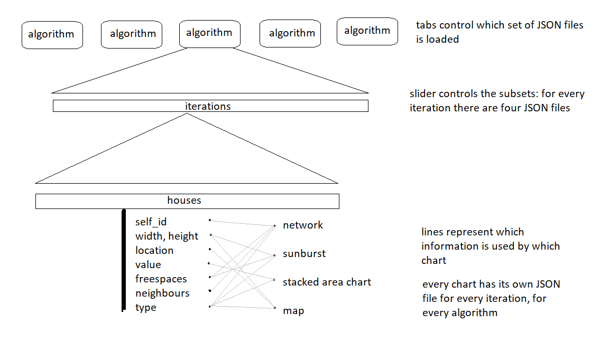

###### Study:       Minor Programming, University of Amsterdam
###### Course:      Programmeerproject
###### Name:        Luc Stefelmanns
###### Student nr.: 10669124

# Data
The data is generated by the algorithms from Heuristics. For every algorithm a JSON file is created, containing a list with information about the created map at every iteration. Every iteration has a list with houses, which has a id (int), width (float), height (float), location (dict of floats), value (float), freespaces (list of distances to neighbours, ordered by size), neighbours (list of ids, ordered synchronic as freespaces) and a type (string).

# Diagram
This diagram shows the technical aspects that work behind the scenes to ensure the page will function.

# Technical components
The creation of the data requires a CSVtoJSON function. For this to function the data of the algorithms have to be saved as a CSV in the existing Python code.

Every chart will have its own script. There is also a overal master script that is used to control the charts. The functions present in these scripts will be:
* Stacked area chart:
  1. Read values from JSON
  2. Order per type
  3. Create area
  4. Create stack
  5. Handle click-on event
  6. Highlight one house
* Map:
  1. Read locations, widths and heights from JSON
  2. Create rects at locations
  3. Handle click-on event
  4. Highlight one house
* Sunburst diagram:
  1. Read freespaces, widths and heights from JSON
  2. Create first layer
  3. Create second layer
  4. Create third layer
  5. Create fifth layer
  6. Handle click-on event
* Network:
  1. Read id and neighbours from JSON
  2. Create nodes
  3. Create links
  4. Change number of links
  5. Handle click-on event

# Sources of inspiration
Slider examples:
http://thematicmapping.org/playground/d3/d3.slider/

Temperature slider:
https://bl.ocks.org/mbostock/6452972

Double slider:
https://bl.ocks.org/Lulkafe/3832d628340038d9484fbd9edb705e01

Time slider:
http://romsson.github.io/dragit/example/nations.html

Stacked area chart:
https://bl.ocks.org/mbostock/3885211
