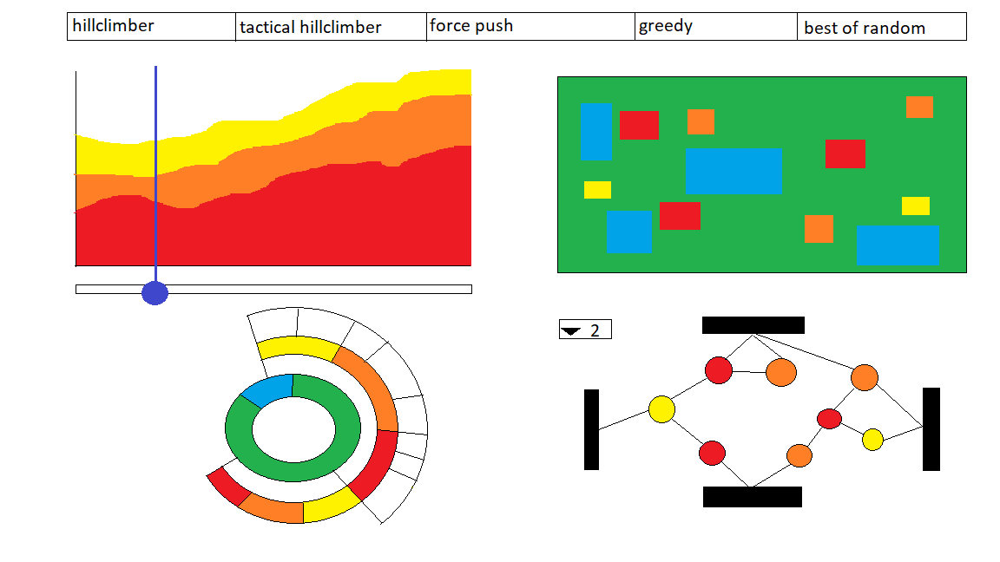

# Amstelhaege algorithms

###### Study:       Minor Programming, University of Amsterdam
###### Course:      Programmeerproject
###### Name:        Luc Stefelmanns
###### Student nr.: 10669124

## Problem statement

When testing algorithms to solve the case of Amstelhaege, it can be difficult to interpret the results based on maps alone. The addition of a line graph with the score and an animation of the movement of houses can give some insight in the process of the algorithms, but do not properly show the underlying principles that ultimately determine the score achieved. What is missing are visualisations that show the relation between the houses and the distribution of freespace over the houses. This does not only enhance the understanding of the Amstelhaege case, but makes it easier to reinterpret the results for other cases that evolve around the positioning of objects in the Euclidean space.

## Solution

**This visualisation solves the lack of information by visualising the houses on the map as a network and the distribution of freespace as a sunburst diagram.**

In the tabs the different algorithms are represented, with one page for every algorithm. Every page consists of four visualisations:

* Coloured map with the houses in their Euclidean position.
* Network that interprets he relation between the houses, with nodes representing houses and links representing closest neighbours (with a drop-down menu the number of neighbours can be chosen).
* Sunburst diagram that shows how the total area is used.
* Stacked area chart to visualise the score achieved.

A slider makes it possible to walk trough time, to follow the movement of houses and the impact this has on the network and sunburst diagram. If the user clicks on an area in the stacked chart, piece of the sunburst, node in the network or rectangle on the map, the corresponding elements will be highlighted in the other visualisations.

MVP: The most important elements are the network, piechart and tabs that make it possible to change between algorithms.

## Prerequisites

The data will be generated with Python. The data will consist of the position, value and freespace of all the houses during the entire runtime of the algorithm. The external components that will be used is the d3-tip (https://github.com/Caged/d3-tip) to implement tooltips for the visualisations. The network will be generated with help of code on blocks (https://bl.ocks.org/EfratVil/58b872b4f15a358c3a9822f5a285c5be), the other visualisations will be created with the standard d3 library.

It is difficult to find a similar visualisation that combines these four elements for this purpose, but there are examples of the individual visualisations abound.

* Network: http://bl.ocks.org/jose187/4733747
* Stacked area chart: https://bl.ocks.org/mbostock/3885211
* Sunburst diagram: https://bl.ocks.org/kerryrodden/7090426
* Rects for map: https://www.dashingd3js.com/svg-basic-shapes-and-d3js

The most difficult part will be the translation from a map top a network, since the links are not yet present in the dataset. The second most difficult part will be the creation of the sunburst diagram, due to the fact that the data only has the freespace of the house in meters, not as a surface.
