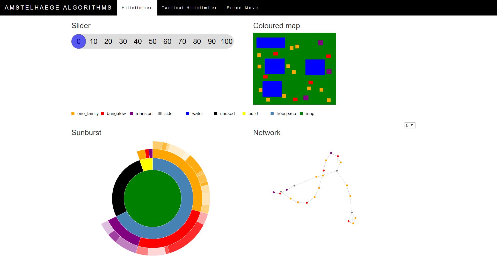

## Report

#### Description
This visualisation tries to show the underlaying data of
algorithms that are used to solve the case of Amstelhaege of the
course Heuristics.
For this case, houses have to be placed on a map to maximize the
total value of all houses. The value of each house is influenced
by the freespace of that house, which is the space between the
house and its closest neighbour.

Three types of visualisation are used: a map to show the locations of the houses on the map, a sunburst to show how the map is used and a network to show the connection between houses in terms of neigbourhood. There is also a slider that can be used to slide through the iterations and a dropdown menu to choose how many neighbours of a house you want to be represented in the network.

#### Technical Design
The scripts are categorised in three groups: python script to process data, javascripts to create the visualisations in d3 and html scripts to create the webpages. The javascripts are all of one of the visualisations, plus one for the slider and one main script that brings everything together. All scripts except for the main only contain functions, whilst the main is used for the running of these functions.

The main imports the data from a single json file (this is the only point in which data is imported, to keep the website smooth and fast), which contains a dictionary for each visualisation. Every dictionary element is a list of 101 elements (starting situation + 100 iterations), of which each element gives all the information to create that particular visualisation for that particular iteration. The main uses this data to create the three visualisations and gives the data to the slider, which in turn uses this to update the visualisations.

Every visualisation algorithm is in essence made out of two functions: one to create the visualisation and one to update the visualisation. Some have auxiliary functions (like a ticked function for the network, and functions for the sunburst to create the arcs) that are needed to create the visualisation. Besides these, the network has functions to create and control the dropbox. The slider script only has a function to create the slider and an internal function that updates all the visualisations at the same time.

#### Challenges & Decisions
The biggest challenge was understanding how to create update functions for the visualisations. It started with deleting all elements and creating them again, but this was not a pretty solution (both code-wise and for the eye), so I opted for a function that merged the data and updated the existing elements. The problem was that it did work for the network, so I had to switch back to the delete everything option, which was also showing problems. I still do not understand what is going wrong for that visualisation, but I think there must be something wrong with the way I am using the force simulation function.

This is the biggest example for a struggle I was constantly having with d3: a lot has already been created for you in the source code, so you are very dependent on the functionality present and it is difficult to add new things. This has been tiresome, but I was good to be exposed to this since in future projects I will most likely work with already existing pieces of code.

The biggest change I have made is to not create the stacked area chart. This decision was made due to lack of time. It proved to be more time-consuming to create it and with me being sick on the last one and a half day I didn't have time to implement it anymore. I chose to create the stacked area chart last, because it is the least important visualisaton. It would have shown information about something that was easily traceable during Heuristics. In a deadline and disease free world, I would have added the stacked area chart, since it is interesting to see how the price is influenced by the factors shown by the other visualisations.
